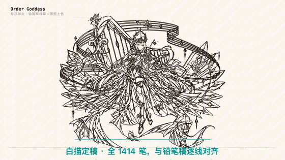
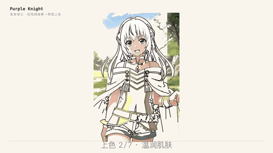
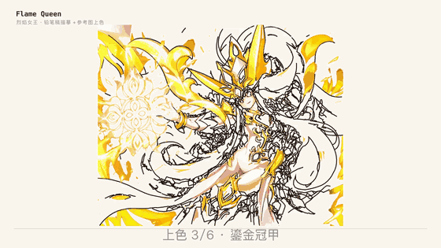
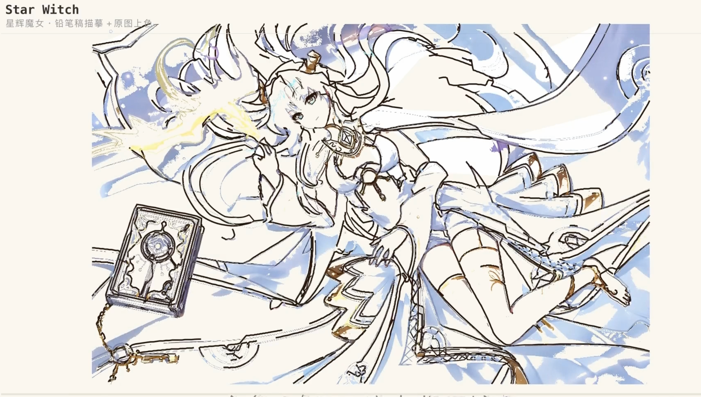

# Manim 手绘创作技能

**铅笔稿负责线条和五官，彩色原稿负责上色；让 AI 按一套可复现的流程，把配对原图制作成 Manim 手绘视频。**

[English](README.en.md) · [安装 manim-handdraw 0.1.1](https://pypi.org/project/manim-handdraw/0.1.1/) · [插件源码](https://github.com/FTZ-OPUS/manim-handdraw)

下面的 GIF 均从作者实际制作的视频截取，展示的是创作案例，不是对任意图片“一键出片”的保证。

| 秩序神女：密集笔画到完整上色 | 紫发女骑士：人物与背景分层 |
| --- | --- |
|  |  |



### 星辉魔女：双眼修复与局部重描



这张是**实际成片画面**，不是彩色参考原图。[查看完整案例源码与运行素材](examples/starlight-witch/README.md)。它保留了原定稿的镜头和笔画编排，展示倾斜双眼的修复、复杂饰品的局部重描，以及线稿到彩色成片的过程。

还有一个可以直接运行的[双图短演示](assets/portrait-preview.gif)，附带配对铅笔稿、彩色原稿、准备脚本和 Manim 源码。

## 这个技能能做什么

它把《星辉魔女》《紫发女骑士》《秩序神女》《烈焰女王》等作品里反复用到的经验变成了可执行步骤：

1. 检查**同构图的两张输入图**是否对齐。从铅笔稿提取线条，从彩色原稿获取颜色及最终画面。
2. 从铅笔稿提取眼睛、嘴等精细五官笔迹，计算准确位置；只剪掉五官窗口内的矢量路径，保留穿过窗口的头发与轮廓。五官像素是原稿提取后在动画中显现，**不是声称每一笔都由矢量画出**。
3. 用 `manim-handdraw` 绘制其余线条、处理密集区域线宽、逐层上色，并检查线条阶段、五官特写、上色阶段和最终帧。

入口是 [SKILL.md](SKILL.md)。参考经验在 [references/portrait-workflow.md](references/portrait-workflow.md)，可执行命令在 [examples/paired-inputs.md](examples/paired-inputs.md)。整个文件夹可以复制到支持 `SKILL.md` 的 AI 技能目录；没有技能系统的 AI 也可以直接阅读这些文档并运行脚本。

## 安装依赖

需要 Python 3.9+。本仓库已附上 `manim-handdraw 0.1.1` 的小型 wheel，在 `vendor/`；`requirements.txt` 会安装这个 wheel 的 `extract` 功能及其 Python 依赖。安装脚本把依赖放在**本文件夹的 `.venv`**，不会替换电脑上已有的 Manim 环境。

macOS / Linux：

```bash
cd manim-handdraw-creator
bash install.sh
```

Windows PowerShell：

```powershell
cd manim-handdraw-creator
powershell -File .\install.ps1
```

Manim 的 Cairo、Pango、FFmpeg 等系统依赖与操作系统有关，无法把 macOS 的二进制直接放进一个跨平台 GitHub 技能包。若安装阶段提示缺少它们，请按 [Manim Community 官方安装指南](https://docs.manim.community/en/stable/installation.html)配置。`vendor/` 内是插件本身，其他依赖仍需由 pip 下载。

安装后，按照 [配对样图操作示例](examples/paired-inputs.md)运行脚本，再用 `.venv/bin/manim`（Windows 为 `.venv\Scripts\manim.exe`）渲染 `PortraitPreview`。不想创建新环境，也可在已经装好 `manim-handdraw[extract]>=0.1.1` 的环境中直接运行。

## 交给 AI 的提示词

> 请阅读这个文件夹的 `SKILL.md` 和需要的 `references/`。我会提供构图一致的铅笔稿和彩色原稿。先验证两图对齐，再提取线条和原铅笔稿的五官笔迹，用 `manim-handdraw` 做逐笔绘制、分层上色，并渲染几个关键帧检查；不要把五官像素说成逐根矢量手画。最后给我可运行的 Manim 源码、视频和你检查过的结果。

## 能力边界

这是一套**创作工作流和工具**，可以显著减少重复写提取、避让和上色代码的工作；它并没有自动理解任意单张彩色图片，更不能保证每张图无需人工检查就达到发布质量。如果只有一张彩色图，仍需先得到与其对齐的铅笔稿/线稿，复杂发丝、饰品和脸部可能需要修线与镜头编排。成片是否适合发布还取决于画面质量和素材使用权。

代码与技能文本沿用 [MIT 许可](LICENSE)；示例原画、视频截取动图的使用说明见 [ASSET-NOTICE.md](ASSET-NOTICE.md)。
